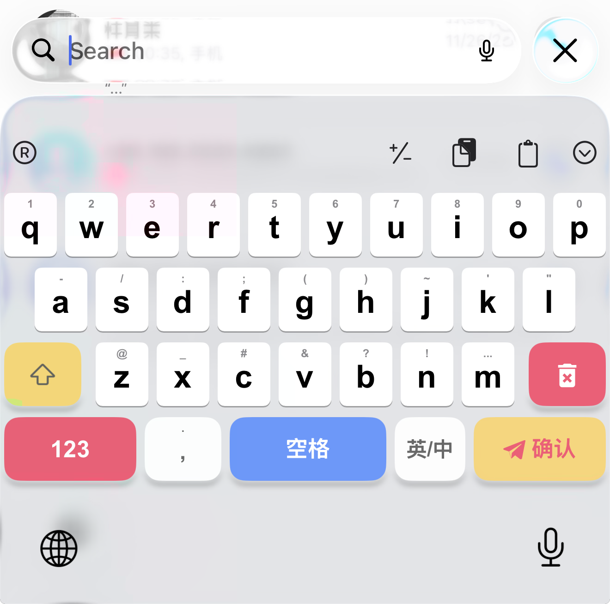
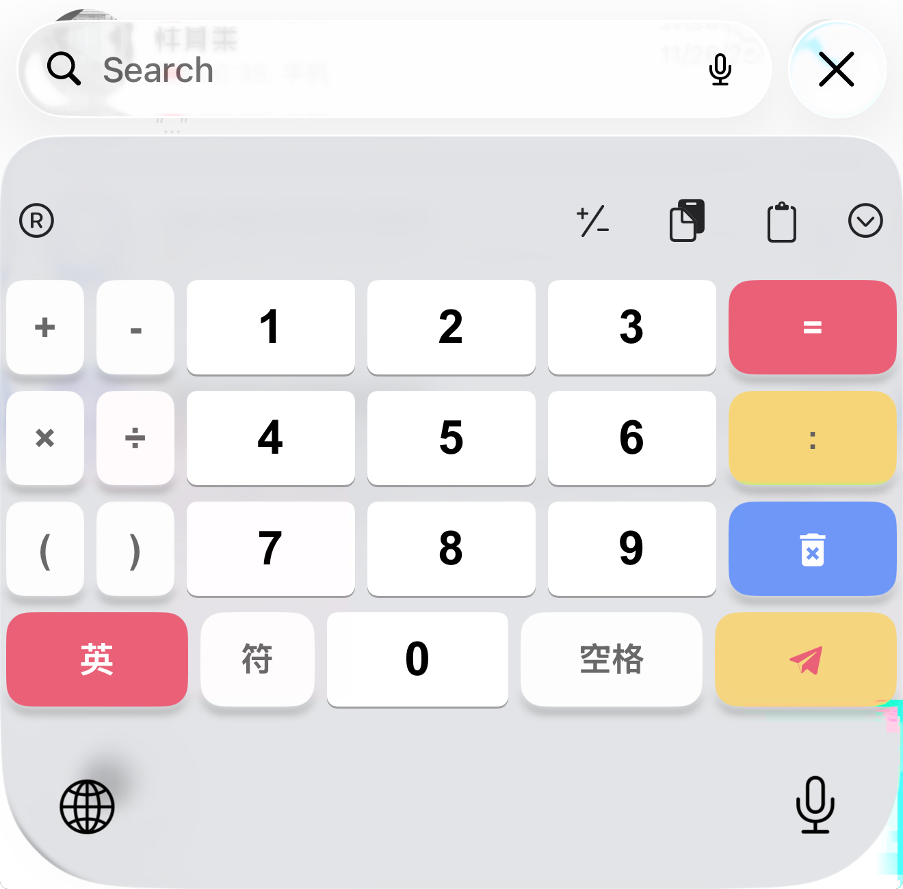
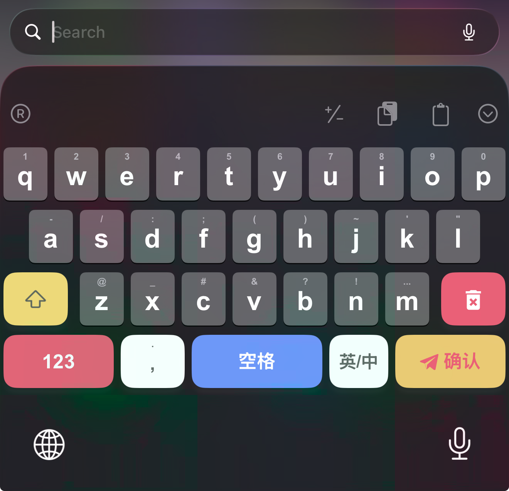
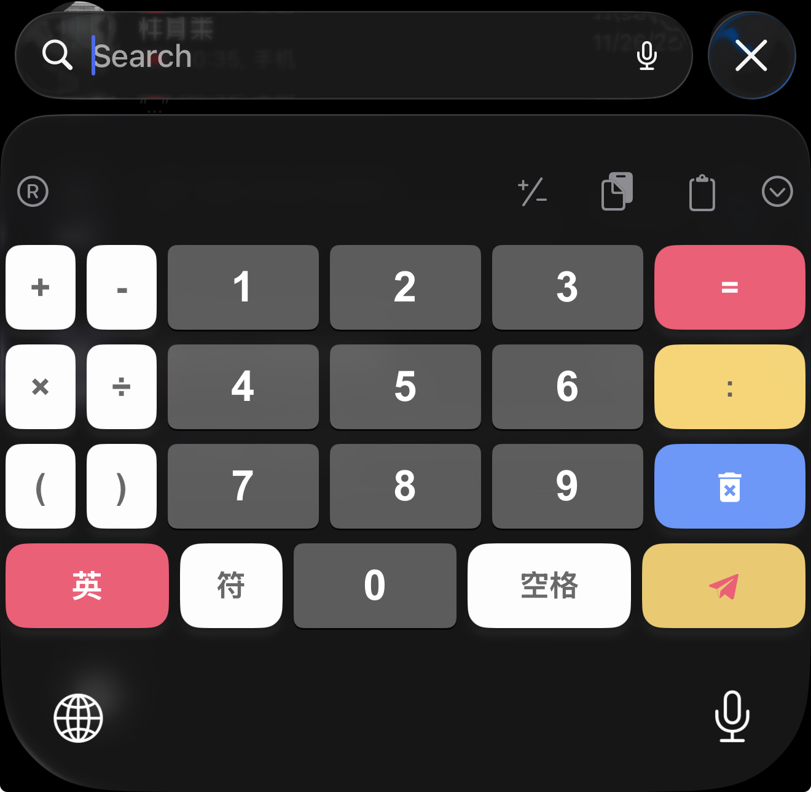

# Rime Theme （仿微信输入法键位）

Rime Theme 是一个为 Rime 输入法引擎提供第三方主题的仓库，是 [oh-my-rime|薄荷输入法](https://github.com/ibupliz/oh-my-rime) 项目的补充。

## 主题预览

该仓库是基于 [Rime Theme](https://github.com/Mintimate/RimeTheme)做修改，模仿微信输入法的键位和上划符号。

### 亮色预览

### 暗色预览

